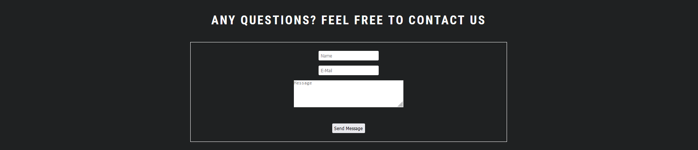

# tiger_strike_karate
# TigerStrike Karate  
 
# Description
TigerStrike Karate is a fictional Webpage installed to extend the online presence for the TigerStrike Karate School. The viewer will be able to get a first look into the Karate School by seeing students in practice and getting a introduction of the sensei(main coach). Website visitors will also be able to see the location of the school, opening hours and class times. Furthermore there is a signup form, where you are actually able to sign up online to the karate school or just leave a non-committal inquiry via the message form at the front page.

[Click here to view the Live Project](https://arp-25.github.io/tiger_strike_karate/index.html)

## Table of contents

- User Experience (UX)
- Features
- Design
- Technologies Used
- Testing
- Deployment
- Credits

## User Experience (UX)

### User stories

- Visitor Goals
    - Easily understand what the aim of the page is.
    - Comfortably navigate through the site and access the content.
    - Be able to get a quick idea of the benefits signing up to a Karate School.
    - Get a grasp if a signup is suitable for one self.
    - Have information where the school is located.
    - Get in contact via text message, e-mail or phone.
    - Sign up online.

## Features

### Existing Features

- F01 Navigation Bar
     - The navigation bar is kept very simple to provide a uncomplicated and clear way to navigate through the site. It consists of a logo link to the left and home, gallery and signup link to the right.

 

- F02 Banner with Slogans
     - The banner is there to greet the site visitor with a welcoming picture.
     - The purpose of the slogans is to show the visitor what benefits he can expect from joining the school.

 

- F03 Meet the Sensei 
    - In this section visitors are able to get a introduction to the TigerStrike Karate sensei(main coach) by getting a picture, video and short text description presented.

   

- F04 Location and Classes
    - Here the visitor gets access to the school location and opening times/classes.
    - For the location a google maps iframe element got embedded.
    - For the classes the user will get the infos from a apparent table.

 

- F05 Contact
    - Small contact form for curious visitors which want to get in touch with a non-commital message.
    - Picture of people connecting making it clear that this is the section provided to get easily in contact. 

 

- F06 Footer
    - The Footer element is showcasing all social Links.

 

- F07 Gallery
    - Gallery implemented as a slider to give user a comfortable and easy way to watch through the pictures.

 

- F08 Sign up
    - Form for signing into the school.

### Features which could be implemented in teh future

- Student reviews/comments.
- Login to access personal account which can contain infos about progress in the course or a learning plattform where you can watch lessons or technique videos.
- Forum.
- News section.

## Design

-   ### Imagery
    -   The pictures throughout the site are chosen to present the TigerStrike Karate School including their sensei and students. The viewer is directly given the information of what he can expect joining the school. 

-   ### Colour Scheme
    -  The color Scheme is adjusted to fit to a Karate School. For example a Karate Gi is usually associated with a white robe and a black belt and just has a minimal look. Therefore a simple white has been chosen for the font and a dark gray (rgb(31, 33, 34))for the background and several elements to keep it clean and provide a good contrast.

-   ### Typography
    -   Google Fonts was used to import Roboto Condensed font into styles.css.  It was chosen because it has a modern design, balanced proportions and open letterforms which contribute to its readability.

-   ### Wireframes

    -   #### Main Page Wireframes

        

    -   #### Gallery Page Wireframes

        

    -   #### Sign up Page Wireframes

        

## Technologies Used

### Languages Used

-   [HTML5](https://en.wikipedia.org/wiki/HTML5)
-   [CSS3](https://en.wikipedia.org/wiki/Cascading_Style_Sheets)
-   [Markdown](https://de.wikipedia.org/wiki/Markdown)

### Frameworks, Libraries & Programs Used

-   [CodeAnywhere:](https://app.codeanywhere.com/) was used as IDE to create the code. It provides good compatibility with github and offers useful IDE extensions.
-   [Google Fonts:](https://fonts.google.com/) was used to import fonts.
-   [Font Awesome:](https://fontawesome.com/) was used to add icons for aesthetic and UX purposes.
-   [GitHub:](https://github.com/) is used as the respository for the projects code after being pushed from Git.
-   [ILoveImg:](https://www.iloveimg.com) was used for resizing images and editing photos for the website.
-   [Balsamiq:](https://balsamiq.com/) was used to create the wireframes during the design process.
